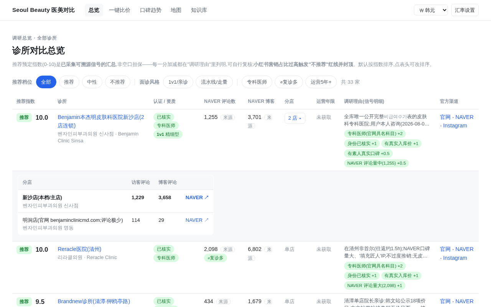
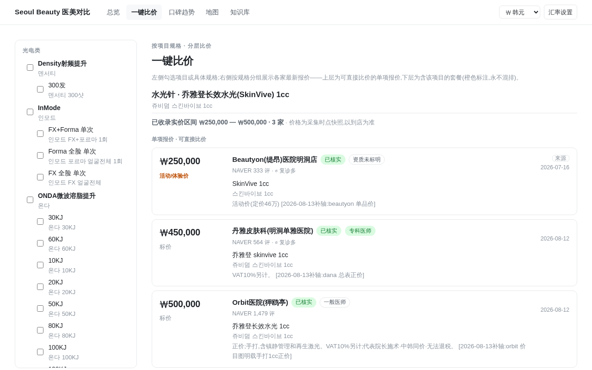
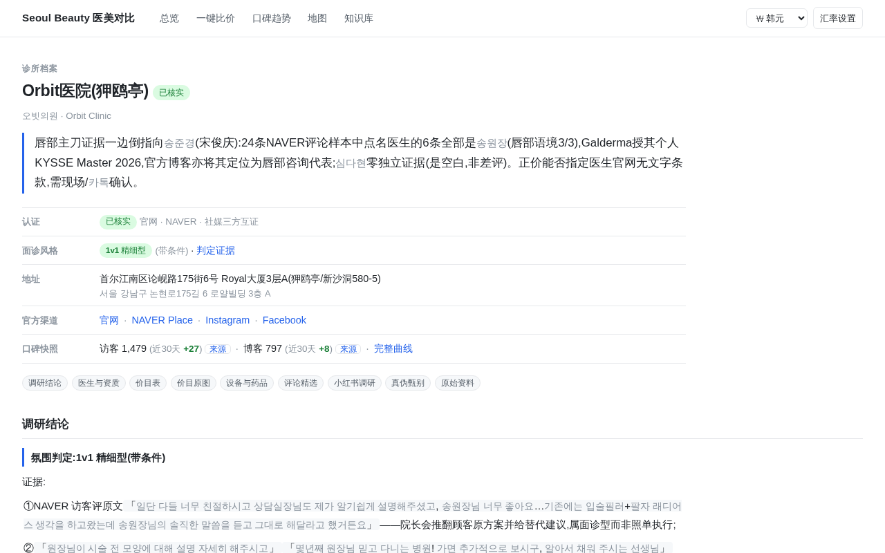

# Seoul Clinic Research

[](LICENSE)


用你自己的 AI agent,建一座**可核验**的医美诊所比价站——调研 skill、强校验数据管线、只读 API、前端网页,全都在这个仓库里。每条价格、评分、评论都带来源链接和采集日期。

在线浏览(需口令):<https://seoul-beauty.dabinwu.com>

| 总览 | 一键比价 | 诊所档案 |
|---|---|---|
|  |  |  |

## 为什么

我去首尔做医美,做功课的时候广告太多:

- 怕碰到小红书上专坑中国人的店。打广告可以,专门宰国人让我觉得自己像傻子
- 哪怕知道了 NAVER,不懂韩语,自己人工调研还是很艰难
- 所谓的信息分享贴、避雷大全,点进去也全是要你加群,估计也是一大堆医托

AI 时代了,该取消这种中间商赚差价了。让 agent 自己去 NAVER、Google、Instagram、Facebook、小红书上挖,每条都带来源链接和采集日期。

## 快速开始

```bash
git clone https://github.com/heyidi/seoul-clinic-research && cd seoul-clinic-research
```

让你的 agent 读这两个文件,然后说一句「调研 XX 诊所」——建环境、建库、抓数据、校验入库、起站,它自己照着做。

- [`AGENTS.md`](AGENTS.md) — 仓库操作手册:常用命令、数据流、纪律红线。Claude Code 用户复制一份成 `CLAUDE.md`,其他框架多数原生认
- [`skills/researching-korean-clinics/`](skills/researching-korean-clinics/SKILL.md) — 一个标准 Agent Skill,调研诊所时自动触发;单独拷到别的项目里也能用

> **本仓库不含真实调研数据。**`examples/` 里有一份虚构记录,用来确认环境正常。

## 发布成网页

```bash
SITE_REPO=你/你的产物仓 deploy/publish_site.sh
```

导出纯静态站推 GitHub Pages,不需要服务器,打开就是总览页。导出时强制剥掉小红书账号令牌、抹掉快照里第三方泄漏的 API key、附加 robots.txt 禁抓。

## 目录

```
app/        FastAPI 只读 API;推荐指数=可溯源信号加总,营销占比过高封顶
web/        原生 JS 前端,无构建步骤
scripts/    建库 / 录入校验 / 静态导出 / NAVER 快照 / 小红书限频包装
skills/     给 agent 的调研技能——这个仓库最值钱的部分
docs/       数据格式契约、调研决策日志
examples/   虚构示例记录
tests/      pytest,60 个
```

## 免责

agent 调研产出只做参考,不是医疗建议;抓取请遵守目标平台的条款和当地法律。
